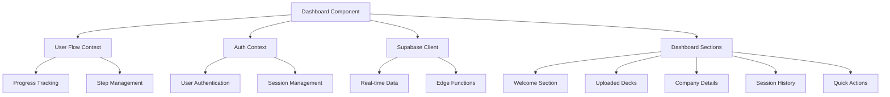
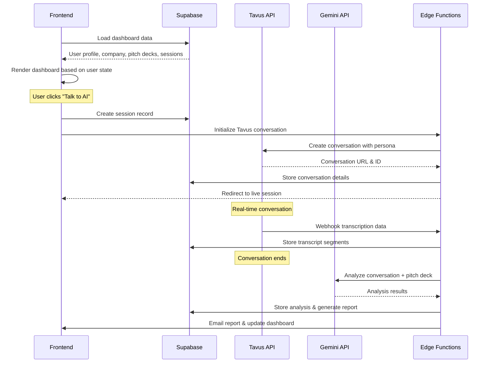

# Design Document

## Overview

The Founder Dashboard Enhancement builds upon the existing React/TypeScript application with Supabase backend to create a streamlined, wireframe-based dashboard interface. The design integrates with the current user flow system, Tavus AI conversations, real-time transcription, and Gemini analysis to provide a comprehensive founder experience.

The dashboard serves as the central hub after onboarding completion, adapting its interface based on whether the user is first-time (directing to AI conversation) or returning (showing session history and new session options).

## Architecture

### Frontend Architecture



### Backend Integration Flow



## Components and Interfaces

### Core Dashboard Component

```typescript
interface DashboardProps {
  // No props needed - uses contexts
}

interface DashboardState {
  user: User | null;
  profile: Profile | null;
  company: Company | null;
  pitchDecks: PitchDeck[];
  sessions: Session[];
  loading: boolean;
  error: string | null;
  isFirstTimeUser: boolean;
}
```

### Dashboard Sections

#### 1. Welcome Section
```typescript
interface WelcomeSectionProps {
  userName: string;
  companyName: string;
  isFirstTime: boolean;
}
```

#### 2. Uploaded Decks Section
```typescript
interface UploadedDecksProps {
  decks: PitchDeck[];
  onViewDeck: (deckId: string) => void;
  onUploadNew: () => void;
}

interface DeckStatus {
  id: string;
  name: string;
  uploadDate: string;
  status: 'processing' | 'processed' | 'failed';
  processingProgress?: number;
}
```

#### 3. Company Details Section
```typescript
interface CompanyDetailsProps {
  company: Company;
  profile: Profile;
  onEdit: () => void;
}

interface CompanyInfo {
  name: string;
  industry: string;
  stage: string;
  oneLiner: string;
  completionPercentage: number;
}
```

#### 4. Session History Section
```typescript
interface SessionHistoryProps {
  sessions: Session[];
  onViewSession: (sessionId: string) => void;
  onStartNew: () => void;
}

interface SessionSummary {
  id: string;
  date: string;
  investorPersona: string;
  duration: number;
  status: 'completed' | 'failed';
  keyOutcomes: string[];
}
```

#### 5. Talk to AI Integration
```typescript
interface TalkToAIProps {
  isFirstTime: boolean;
  hasProcessedDeck: boolean;
  onStartConversation: () => void;
}

interface ConversationSetup {
  sessionId: string;
  selectedPersona: InvestorPersona;
  pitchDeckId: string;
  tavusConversationUrl: string;
}
```

### Tavus Integration Components

#### Persona Selection
```typescript
interface PersonaSelectionProps {
  personas: InvestorPersona[];
  onSelect: (persona: InvestorPersona) => void;
  selectedPersona?: InvestorPersona;
}

interface InvestorPersona {
  id: string;
  name: string;
  description: string;
  specialty: string;
  experience: string;
  conversationStyle: string;
  focusAreas: string[];
  avatarUrl: string;
}
```

#### Live Conversation Interface
```typescript
interface LiveConversationProps {
  sessionId: string;
  conversationUrl: string;
  persona: InvestorPersona;
  onConversationEnd: (sessionId: string) => void;
}
```

## Data Models

### Enhanced Database Schema

```sql
-- Sessions table for tracking AI conversations
CREATE TABLE sessions (
  id UUID PRIMARY KEY DEFAULT gen_random_uuid(),
  user_id UUID REFERENCES auth.users(id) ON DELETE CASCADE,
  company_id UUID REFERENCES companies(id) ON DELETE CASCADE,
  pitch_deck_id UUID REFERENCES pitches(id) ON DELETE SET NULL,
  tavus_conversation_id TEXT,
  tavus_persona_id TEXT NOT NULL,
  status TEXT CHECK (status IN ('created', 'active', 'completed', 'failed')) DEFAULT 'created',
  duration_minutes INTEGER,
  created_at TIMESTAMP WITH TIME ZONE DEFAULT NOW(),
  started_at TIMESTAMP WITH TIME ZONE,
  completed_at TIMESTAMP WITH TIME ZONE
);

-- Conversation transcripts
CREATE TABLE conversation_transcripts (
  id UUID PRIMARY KEY DEFAULT gen_random_uuid(),
  session_id UUID REFERENCES sessions(id) ON DELETE CASCADE,
  speaker TEXT CHECK (speaker IN ('founder', 'investor')) NOT NULL,
  content TEXT NOT NULL,
  timestamp_ms INTEGER NOT NULL,
  created_at TIMESTAMP WITH TIME ZONE DEFAULT NOW()
);

-- AI Analysis results
CREATE TABLE conversation_analysis (
  id UUID PRIMARY KEY DEFAULT gen_random_uuid(),
  session_id UUID REFERENCES sessions(id) ON DELETE CASCADE,
  gemini_analysis JSONB,
  key_strengths TEXT[],
  improvement_areas TEXT[],
  follow_up_questions TEXT[],
  overall_score INTEGER CHECK (overall_score >= 1 AND overall_score <= 10),
  created_at TIMESTAMP WITH TIME ZONE DEFAULT NOW()
);

-- Session reports
CREATE TABLE session_reports (
  id UUID PRIMARY KEY DEFAULT gen_random_uuid(),
  session_id UUID REFERENCES sessions(id) ON DELETE CASCADE,
  report_data JSONB NOT NULL,
  email_sent BOOLEAN DEFAULT FALSE,
  email_sent_at TIMESTAMP WITH TIME ZONE,
  created_at TIMESTAMP WITH TIME ZONE DEFAULT NOW()
);
```

### TypeScript Interfaces

```typescript
interface Session {
  id: string;
  user_id: string;
  company_id: string;
  pitch_deck_id?: string;
  tavus_conversation_id?: string;
  tavus_persona_id: string;
  status: 'created' | 'active' | 'completed' | 'failed';
  duration_minutes?: number;
  created_at: string;
  started_at?: string;
  completed_at?: string;
}

interface ConversationTranscript {
  id: string;
  session_id: string;
  speaker: 'founder' | 'investor';
  content: string;
  timestamp_ms: number;
  created_at: string;
}

interface ConversationAnalysis {
  id: string;
  session_id: string;
  gemini_analysis: any;
  key_strengths: string[];
  improvement_areas: string[];
  follow_up_questions: string[];
  overall_score: number;
  created_at: string;
}

interface SessionReport {
  id: string;
  session_id: string;
  report_data: {
    summary: string;
    transcript: ConversationTranscript[];
    analysis: ConversationAnalysis;
    recommendations: string[];
    next_steps: string[];
  };
  email_sent: boolean;
  email_sent_at?: string;
  created_at: string;
}
```

## Error Handling

### Frontend Error Boundaries

```typescript
interface ErrorBoundaryState {
  hasError: boolean;
  error?: Error;
  errorInfo?: ErrorInfo;
}

class DashboardErrorBoundary extends Component<PropsWithChildren, ErrorBoundaryState> {
  // Handle dashboard-specific errors
  // Provide fallback UI for critical failures
  // Log errors for debugging
}
```

### API Error Handling

```typescript
interface APIError {
  code: string;
  message: string;
  details?: any;
}

const handleSupabaseError = (error: PostgrestError): APIError => {
  // Map Supabase errors to user-friendly messages
  // Handle authentication errors
  // Handle network connectivity issues
};

const handleTavusError = (error: any): APIError => {
  // Handle Tavus API failures
  // Provide fallback conversation options
  // Log for monitoring
};
```

### Conversation Flow Error Handling

```typescript
interface ConversationErrorHandler {
  onTavusConnectionFailed: (sessionId: string) => void;
  onTranscriptionFailed: (sessionId: string) => void;
  onAnalysisFailed: (sessionId: string) => void;
  onReportGenerationFailed: (sessionId: string) => void;
}
```

## Testing Strategy

### Unit Testing

```typescript
// Dashboard component tests
describe('Dashboard Component', () => {
  test('renders welcome section for first-time users');
  test('shows session history for returning users');
  test('handles loading states appropriately');
  test('displays error messages correctly');
});

// User flow integration tests
describe('User Flow Integration', () => {
  test('adapts dashboard based on user progress');
  test('guides first-time users to AI conversation');
  test('provides appropriate next steps');
});
```

### Integration Testing

```typescript
// Supabase integration tests
describe('Supabase Integration', () => {
  test('fetches user data correctly');
  test('creates session records');
  test('handles real-time updates');
  test('manages authentication state');
});

// Tavus integration tests
describe('Tavus Integration', () => {
  test('creates conversations successfully');
  test('handles webhook data');
  test('manages conversation lifecycle');
});
```

### End-to-End Testing

```typescript
// Complete user journey tests
describe('Complete User Journey', () => {
  test('first-time user: onboarding → dashboard → AI conversation');
  test('returning user: dashboard → session history → new conversation');
  test('conversation flow: setup → live session → analysis → report');
});
```

### Performance Testing

```typescript
// Dashboard performance tests
describe('Dashboard Performance', () => {
  test('loads within 3 seconds');
  test('handles large session history');
  test('manages real-time updates efficiently');
  test('optimizes re-renders');
});
```

## Implementation Notes

### Responsive Design
- Mobile-first approach with card-based layout
- Collapsible sections for mobile screens
- Touch-friendly interaction elements
- Progressive enhancement for desktop features

### Accessibility
- ARIA labels for all interactive elements
- Keyboard navigation support
- Screen reader compatibility
- High contrast mode support
- Focus management for modal interactions

### Performance Optimization
- Lazy loading for session history
- Memoized components to prevent unnecessary re-renders
- Optimistic updates for better UX
- Efficient data fetching with React Query or SWR
- Image optimization for persona avatars

### Security Considerations
- Row Level Security (RLS) policies in Supabase
- Input validation for all user data
- Secure handling of Tavus API credentials
- HTTPS enforcement for all communications
- Rate limiting for API calls

### Monitoring and Analytics
- Error tracking with Sentry or similar
- Performance monitoring
- User interaction analytics
- Conversation success metrics
- Dashboard usage patterns